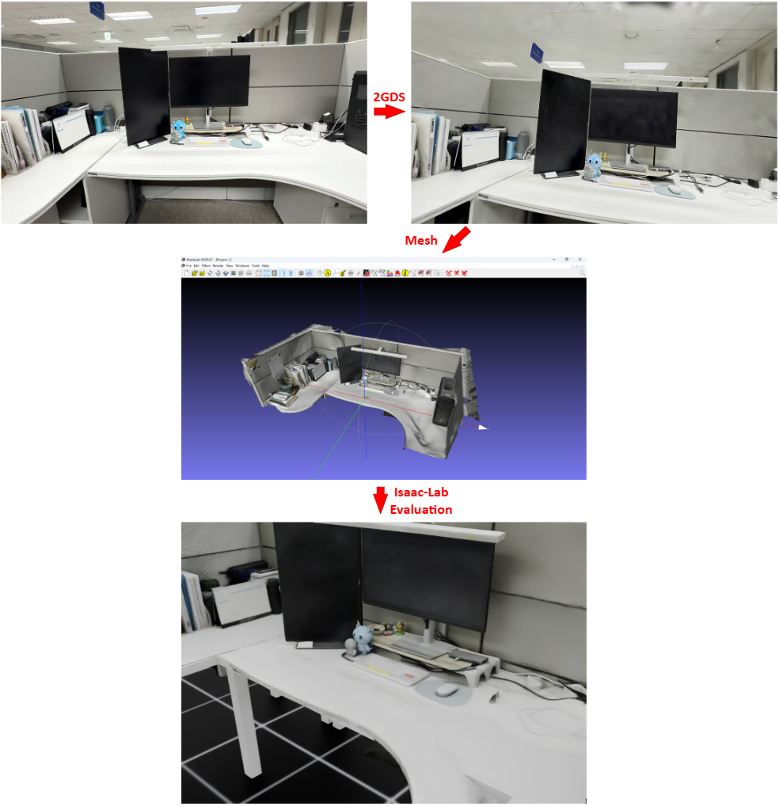

# project-DT (Digital Twin)

A repository covering the full flow of scanning a lab desk with 2DGS into a
3D USD asset, then training/evaluating a VLA policy on a task built in Isaac
Sim on top of that real-scan background.

It also contains the full flow for the non-scanned counterpart: the same
task built from stock Isaac Sim assets (monitor/keyboard/mouse etc.), with
the same VLA policy training/evaluation.




## 1️⃣ Full Flow

```
Smartphone video capture (multi-view scan around the desk, 1080p-60FPS)
  | stage 1-4 : 3D reconstruction : 2d-gaussian-splatting/scan (COLMAP -> 2DGS -> TSDF mesh)
  v
Mesh (fuse_post.ply)
  | stage 5-6 : mesh asset (.ply) : postprocess_mesh.py (pick align/scale/crop) -> replica_to_usd.py
  v
USD asset (Isaac-franka/envs/office_scan/assets/take6_desk_hq.usd)
  | stage 7 : scene check : envs/...
  v
env4 benchmark scene (protocol office-scan-v1, code constants are the source of truth)
  | stage 8-9 : data generation : state machine -> 447 successful demos -> LeRobot dataset conversion
  v
LeRobot dataset
  | stage 10 : fine-tuning : GR00T N1.5-3B, vision/LLM frozen, 32k steps
  v
checkpoints (checkpoints/..)
  | stage 11 : eval
  v
Results
```

## 2️⃣ Stage-by-stage Commands

### Reconstruction: video -> mesh (stage 1-4)

Put the video under `2d-gaussian-splatting/data/raw/` and pass the filename only.

```bash
# stage 1-4 in one go: frame extraction -> COLMAP -> 2DGS training -> mesh extraction (TSDF)
conda activate surfel_splatting && \
GPU=2 nohup bash 2d-gaussian-splatting/scan/run_scan.sh <video_file>.mp4 > <log_path>.log 2>&1 &
```

### Asset production: mesh -> USD (stage 5-6)

```bash
# stage 5: mesh postprocess -- first try with RANSAC auto-align (for report/preview;
# CPU only, a few minutes. Check the plane list, then rerun with --plane-idx/--flip fixes)
conda activate surfel_splatting && \
python 2d-gaussian-splatting/scan/postprocess_mesh.py \
    --ply 2d-gaussian-splatting/output/<input_mesh_path> \
    --out 2d-gaussian-splatting/data/<output_mesh_path>

# stage 5.1: re-extract the mesh within a distance bound (bounded TSDF -- inside DEPTH_TRUNC [m])
conda activate surfel_splatting && \
GPU=2 MESH=bounded STAGE=4 DEPTH_TRUNC=15 MESH_RES=1536 SDF_TRUNC=0.1 \
    nohup bash 2d-gaussian-splatting/scan/run_scan.sh <video_file>.mp4 > <log_path>.log 2>&1 &

# stage 5.2: crop the mesh to a picked region (meshlab 4-point pick align + crop -> asset PLY)
conda activate surfel_splatting && \
python 2d-gaussian-splatting/scan/postprocess_mesh.py \
    --ply 2d-gaussian-splatting/output/<input_mesh_path> \
    --out 2d-gaussian-splatting/data/<output_mesh_path> \
    --pick-plane \
    --scale <measured/pick_dist> \
    --pick "x,y,z;x,y,z;x,y,z;x,y,z" \
    --pick-box 1.2 # crop to 1.2x the picked box region

# stage 6: USD conversion (inside the container -- pxr needs the kit app; bakes sRGB -> linear)
docker exec -u 0 -e TERM=xterm -e PYTHONUNBUFFERED=1 gr00t_isaac bash -lc "umask 000 && \
    CUDA_VISIBLE_DEVICES=2 /root/project/IsaacLab/isaaclab.sh -p \
    /root/project/Isaac-franka/envs/replica/replica_to_usd.py --headless \
    --up z --floor-pct -1 --no-recenter \
    --ply /root/project/2d-gaussian-splatting/data/<asset>.ply \
    --out /root/project/Isaac-franka/envs/office_scan/assets/<asset>.usd"
```

### Scene check (stage 7)

```bash
# stage 7: once after swapping the asset -- check background/robot/task placement
docker exec -u 0 -e TERM=xterm -e PYTHONUNBUFFERED=1 gr00t_isaac bash -lc \
    "umask 000 && cd /root/project/Isaac-franka/envs/office_scan && \
    CUDA_VISIBLE_DEVICES=2 /root/project/IsaacLab/isaaclab.sh -p \
    preview_office_scan.py --headless --robots 1 --holder 1 --items 4 \
    --out /root/project/out/office_scan_preview"
```

### Data generation -> LeRobot (stage 8-9)

```bash
# stage 8: data generation (one GPU per batch, parallelizable; seeds match office)
BATCHES="m1:100:1,1:220" GPU=2 \
    nohup bash Isaac-franka/envs/office_scan/run_gen_office_scan.sh > <log_path>.log 2>&1 &
BATCHES="m2:200:2,2:230" GPU=3 \
    nohup bash Isaac-franka/envs/office_scan/run_gen_office_scan.sh > <log_path>.log 2>&1 &

# stage 9: LeRobot conversion (host CPU -- input/output both on the mounted NAS)
conda activate gr00t_sh && \
IN=/data1/huggingface/sslunder54/datasets/office_scan_markers \
OUT=/data1/huggingface/sslunder54/datasets/office_scan_markers_lerobot \
    nohup bash Isaac-franka/convert/run_convert_office.sh > <log_path>.log 2>&1 &
```

### Fine-tuning (stage 10)

```bash
# full: batch 10 / 32k steps, vision/LLM freeze, needs 24GB of GPU VRAM
conda activate gr00t_sh && \
GPU=3 MODE=full DATASET=<lerobot_path> OUT=<new_ckpt_path> \
    nohup bash Isaac-franka/train/run_finetune.sh > <log_path>.log 2>&1 &
```

### Evaluation (stage 11)

```bash
# stage 11.1: one-shot with automatic server start/stop (full eval = EPISODES_PER_N=50)
conda activate gr00t_sh && \
SERVER_GPU=3 CLIENT_GPU=2 PORT=5561 EPISODES_PER_N=50 \
CKPT=checkpoints/lab_office_sim \
    nohup bash Isaac-franka/envs/office_scan/run_eval_office_scan.sh > <log_path>.log 2>&1 &

# stage 11.2: reuse a running server (for sweeps -- the server is targeted by PORT)
EXTERNAL_SERVER=1 PORT=5561 CLIENT_GPU=2 EPISODES_PER_N=10 \
    bash Isaac-franka/envs/office_scan/run_eval_office_scan.sh
```

## Results

| N (markers) | Lab env SR | Scanned lab env SR |
| --- | --- | --- |
| 1 | 24/50 (48%) | **37/50 (74%)** |
| 2 | 16/50 (32%) | 23/50 (46%) |


## Repository Layout

```
run.sh                   All run commands in one file (same as the stages above)
2d-gaussian-splatting/   stage 1-5: scan -> asset PLY (host, conda surfel_splatting)
                         our glue = scan/, the rest is 2DGS upstream + patched convert.py
Isaac-GR00T/             stage 10-11: GR00T 1.1.0 + local patches + our_configs.py (host, conda gr00t_sh)
IsaacLab/                stage 6-8, 11: Isaac Lab 2.2.1 copy (used inside the container)
Isaac-franka/            4 environments (envs/) + generation/conversion/training/eval runners
                         -- details in Isaac-franka/README.md
checkpoints/             (git-ignored) final ckpt: lab_office_sim (see the server copy)
datasets/ out/ output/   (git-ignored) created at runtime
setting.sh               env/container setup (to be cleaned up)
```
